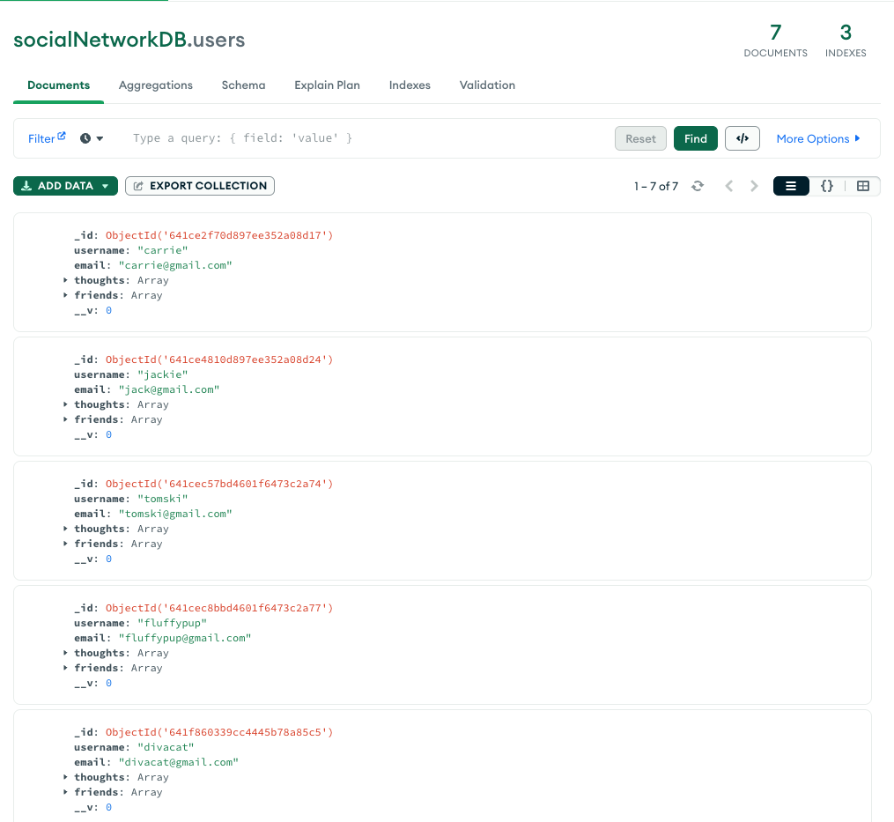

# Social Network API

  ## Table of Contents
  - [Description](#Description)
  - [Installation](#Installation)
  - [Useage](#useage)
  - [Testing](#testing)
  - [Collaborators](#collaborators)
  - [GitHub](#github)
  - [License](#license)

  ## Description 
  In this project I built an API for a social network web application where users can share their thoughts, react to friends’ thoughts, and create a friend list. 

  Social Network API application uses Express.js for routing, a MongoDB database, and the Mongoose ODM, and Moment.js to format timestamps.

  ## Installation
  To run this application you will need to install the following packages;
  - [Express.js](https://www.npmjs.com/package/express)
  - [Mongoose](https://www.npmjs.com/package/mongoose)
  - [Moment.js](https://momentjs.com/)

  This application also uses [Insomnia](https://insomnia.rest/) to test API's and [MongoDB Compass](https://www.mongodb.com/products/compass) to analyze and see MongoDB data.

  

  

  ## Useage 
  Use the command ``npm start`` to run the application on the localhost:3001. To see a walkthrough of the application watch video [here]().

  ## User Routes
  ``GET /api/users``

  ``GET /api/users/:userId``

  ``POST /api/users``

  ``PUT /api/users/:userId``

  ``DELETE /api/users/:userId``

  ``POST /api/users/:userId/friends/:friendId``

  ``DELETE /api/users/:userId/friends/:friendId``
  ## Thought Routes
  ``GET /api/thoughts``

  ``GET /api/thoughts/:thoughtId``

  ``POST /api/thoughts``

  ``PUT /api/thoughts/:thoughtId``

  ``DELETE /api/thoughts/:thoughtId``

  ``POST /api/thoughts/:thoughtId/reactions``

  ``DELETE /api/thoughts/:thoughtId/reactions``

  ## Testing 
  N/A

  ## Collaborators 
  N/A

  ## Questions?
  Contact me at:

  GitHub: https://github.com/RachelWildberger

  Email: rachelwildberger@icloud.com
  
  ## License 
  Social Network API is licensed under the: 
  
  